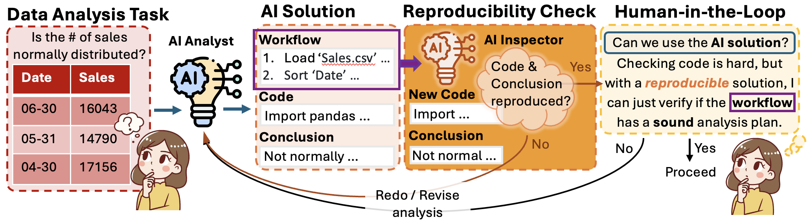
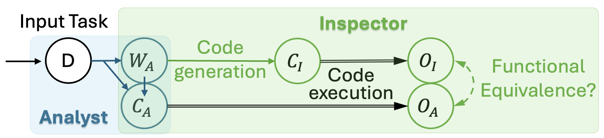

# An Analyst-Inspector Framework for Evaluating Reproducibility of LLMs in Data Science
Official repository for the paper ''_An Analyst-Inspector Framework for Evaluating Reproducibility of LLMs in Data Science_''


## Overview
Large Language Models (LLMs) have demonstrated 
potential for data science tasks via code generation. However, the exploratory nature of data science, alongside the stochastic and opaque outputs of LLMs, raise concerns about their reliability. While prior work focuses on benchmarking LLM accuracy, reproducibility remains underexplored, despite being critical to establishing trust in LLM-driven automation. We propose a novel analyst-inspector framework to automatically evaluate and enforce the reproducibility of LLM-generated data science workflows — the first rigorous approach to the best of our knowledge. Defining reproducibility as the sufficiency and completeness of workflows for reproducing functionally equivalent code, this framework enforces computational reproducibility principles, ensuring transparent, well-documented LLM workflows while minimizing reliance on implicit model assumptions. Using this framework, we systematically evaluate five state-of-the-art LLMs on 1,032 data analysis tasks across three diverse benchmark datasets. We also introduce two novel reproducibility-enhancing prompting strategies. Our results show that higher reproducibility strongly correlates with improved accuracy and reproducibility-enhancing prompts are effective, demonstrating structured prompting’s potential to enhance automated data science workflows and enable transparent, robust AI-driven analysis.


## Environment Setup
### Downloading Data
In the current folder, execute the script to download DiscoveryBench, QRData, and StatQA datasets by running:
   ```
   ./download_data.sh
   ```

### Using GPT-4o and o3-mini
1. Deploy the LLMs on [Azure](https://azure.microsoft.com/en-us/).
2. Create a `.env` file that includes the following keys:
   - `AZURE_OPENAI_API_KEY`
   - `AZURE_OPENAI_ENDPOINT`

### Using Claude-3.5-sonnet
1. Obtain access to LLMs on [Bedrock](https://aws.amazon.com/bedrock/).
2. Create a `.env` file that includes the following keys:
   - `AWS_ACCESS_KEY_ID`
   - `AWS_SECRET_ACCESS_KEY`
   - `AWS_DEFAULT_REGION`

### Using Llama-3.3 and DeepSeek-R1
1. Set Up the [Ollama](https://ollama.com/) Environment.
2. Edit the `/config/api_config.json` file and insert your host information (for example `http://127.0.0.1:11434`).

## Experiments
Execute the following command, replacing the placeholders as needed:
```
python -m experiments.run_experiment --dataset_name {dataset_name} --model_name {model_name} --agent_type {agent_type} --overwrite
```
- {dataset_name}: Choose from `DiscoveryBench`, `QRData`, or `StatQA`
- {model_name}: Choose from `llama-3.3`, `deepseek-r1`, `gpt-4o`, `claude-3-5-sonnet`, or `o3-mini`
- {agent_type}: Choose from `COT`, `ROT`, `REFLEXION`, or `REACT` prompting strategies

**Note:** When using `REFLEXION`, please make sure that you have already obtained the evaluation results for COT.

## Evaluation
Execute the following command, replacing the placeholders as needed:
```
python -m eval.run_reproducibility --dataset_name {dataset_name} --model_name {model_name} --agent_type {agent_type} --accuracy --reproducibility
```
- {dataset_name}: Choose from `DiscoveryBench`, `QRData`, or `StatQA`
- {model_name}: Choose from `llama-3.3`, `deepseek-r1`, `gpt-4o`, `claude-3-5-sonnet`, or `o3-mini`
- {agent_type}: Choose from `COT`, `ROT`, `REFLEXION`, or `REACT` prompting strategies

**Note:** When using `REFLEXION`, please make sure that you have already obtained the evaluation results for COT.

## Analysis
The result file will contain both the accuracy and reproducibility metrics.
1. Accuracy: 
  - `1`: Accurate  
  - `0`: Inaccurate
2. Reproducibility:
  - `1`: Reproducible  
  - `0`: Irreproducible (reproduciblity=0 with executable code in the paper)  
  - `-1`: Irreproducible (reproduciblity=0 with inexecutable code in the paper)

## Citation
To be added.
